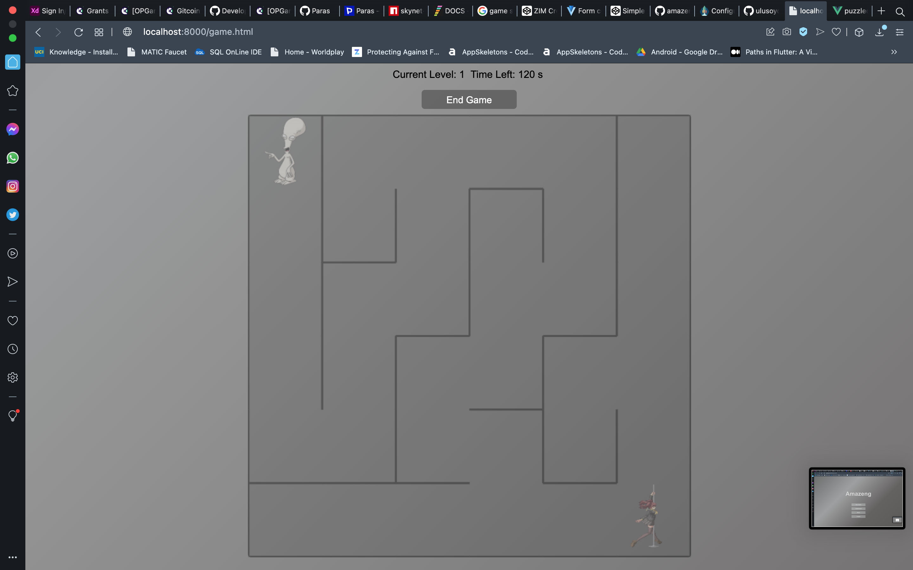
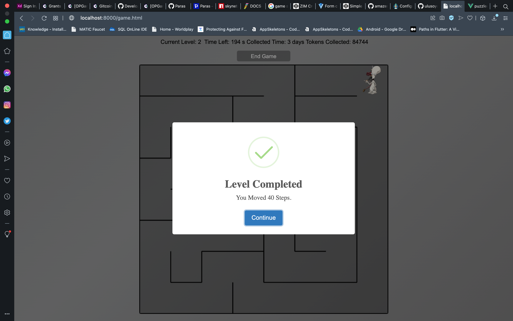

# puzzled

This is a silly POC ERC20 puzzle solving game, the aim is to complete each of the sliding puzzles, but before playing a use needs to purchase PTokens which are used to play the game and each gameplay costs 500 PTokens. The other game is called amazeng which is another puzzle solving game but this time it uses token streaming to reward the user for having played the game the token used is the PToken

### How it works (Puzzled)
1. Player purchases Tokens


2. Player clicks on play and is prompted to accept the 500 PTokens cost of playing the game


3. Once Transactions have been confirmed the player is then taken to the game view where they will have to complete the puzzle in a given amount of time and score which is used as a reward for completing the level the only trick here is the score starts from a maximum and decreases with time so its the users task to ensure they get the highest score for maximum rewards

4. The players scores are recorded and stored on the skynet blockchain 

5. A user can add more time should they wish to do so but the time will cost PTokens


6. At the end of the session the user can either choose to continue or cashout their score in the form of PTokens


7. A users play session is recored and stored on the Leaderboard so other players can watch how a player completed a level


These tokens can also be used to play Amazeng the other game part of this submission


### How it works Amazeng
Simple POC Blockchain Based Maze Solving Game integrated with Sablier Protocol

Solve as many maze puzzle whislt also fighting against time and collecting PTokens to be streamed to you by the end of the game
### Amazeng screenshots








## Project setup
```
yarn install
```

### Compiles and hot-reloads for development
```
yarn serve
```

### Compiles and minifies for production
```
yarn build
```

### Lints and fixes files
```
yarn lint
```

### Customize configuration
See [Configuration Reference](https://cli.vuejs.org/config/).
